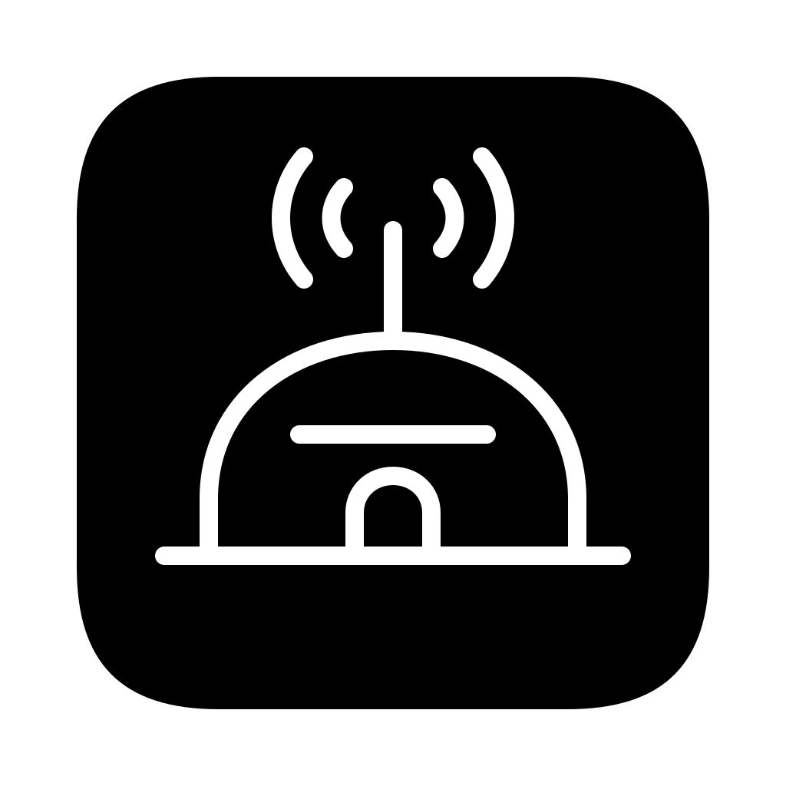
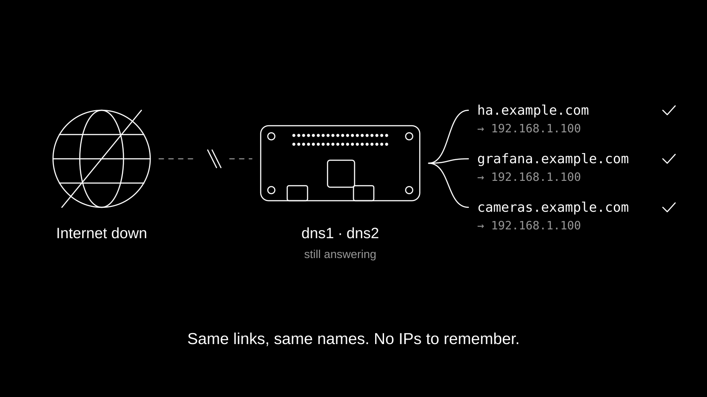
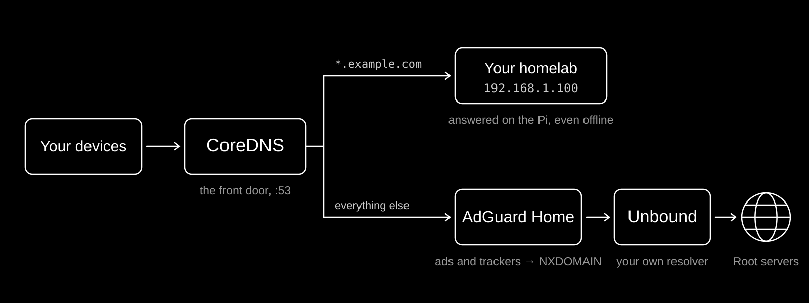
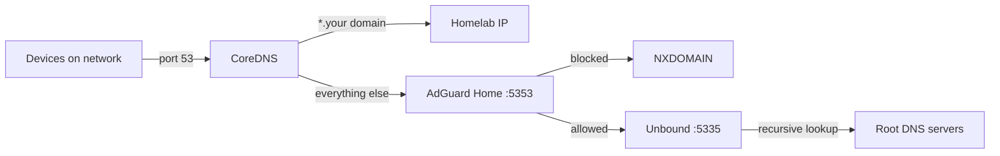
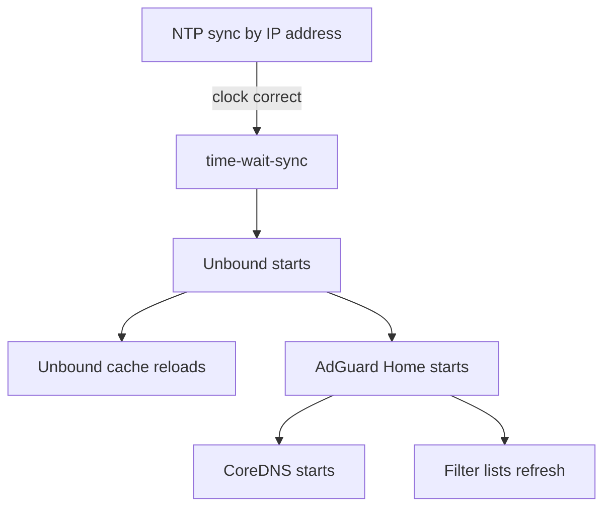

<p align="center">
  
</p>

<h1 align="center">BunkerDNS</h1>

<p align="center">Home DNS and ad blocking that keeps working when the internet doesn't. Your homelab links still open, with no IPs to remember.</p>



## Getting started

1. **Get the hardware.** For each DNS node, a Raspberry Pi Zero 2 W, a Waveshare PoE/ETH/USB HUB HAT and a microSD card. The HAT gives the Pi power and wired ethernet from one cable, so you also need a PoE switch or injector. Build two nodes, `dns1` and `dns2`, so one can reboot while the other answers.
2. **Clone and set up your config.** You need a Mac with [OrbStack](https://orbstack.dev) to build.

   ```sh
   git clone https://github.com/RainnWorks/bunker-dns
   cd bunker-dns
   make init
   ```

   `make init` copies `config.example.nix` to `config.local.nix` and registers it with `git add -N`, so the Nix flake can see the file while its content stays on your machine. It also installs a pre-commit hook that refuses to commit it.
3. **Fill in `config.local.nix`.**

   ```nix
   {
     domain = "example.com";      # every *.example.com name points at localIP
     localIP = "192.168.1.100";   # your homelab server
     sshKey = "ssh-ed25519 AAAA...";
     timeZone = "Europe/London";
   }
   ```

   The build stops with an error while `sshKey` is still the placeholder.
4. **Create the build VM.**

   ```sh
   make setup
   ```

   This creates an OrbStack VM called `nixbuilder` and installs Nix in it.
5. **Build and flash each node.**

   ```sh
   make build HOST=dns1
   make flash HOST=dns1
   ```

   `make flash` hides your system disks and asks which disk to write. Repeat with `HOST=dns2`.
6. **Boot the Pis.** Put in the SD cards and plug in the ethernet. Each node takes an address by DHCP. In your router, reserve that address for each node.
7. **Point your network at them.** Set your router's DHCP DNS servers to the two node addresses.
8. **Check it.** A name under your domain returns your homelab's address:

   ```sh
   dig @<dns1-ip> ha.example.com +short
   ```

## Use

Once your router hands out the two nodes, every device on the network uses them. Nothing needs installing on the devices.

| You want | How |
|---|---|
| Reach a homelab service | Open `anything.example.com`. Every name under your domain resolves to `localIP`, online or off |
| See what is being blocked | Open the AdGuard Home dashboard at `http://<node-ip>:3000` |
| See which device asked for what | `ssh tom@<node-ip>`, then `journalctl --namespace=coredns -f` |
| Change the blocklists or allowlist | Edit `filters` and `user_rules` in `modules/dns/adguardhome.nix`, then deploy |
| Push a change without reflashing | `make deploy HOST=dns1 IP=<node-ip>` |
| Clear a stale DNS answer | `curl http://<node-ip>:8053/flush?d=example.org` for one domain, or `curl http://<node-ip>:8053/flush` for everything |
| Run health checks | `make test IP=<node-ip>` |
| Watch the nodes from Home Assistant | Metrics on `:9100` (system and services) and `:9153` (CoreDNS). See [docs/home-assistant-prometheus.md](docs/home-assistant-prometheus.md) |

`make deploy` builds the new system in the VM, copies only what changed to the node over SSH and switches to it. If you leave out `IP`, it tries `<host>.local`, which only `kitchen-music` announces. A reboot is needed only when the kernel changed, and the switch says so.

The blocklists are the AdGuard DNS filter, OISD (small), a Smart TV list and Fanboy's Annoyances. Blocked names get NXDOMAIN, so apps fail at once instead of hanging on a dead address. The lists are kept on the SD card, so blocking works straight after a reboot.

A `/flush` for one domain also flushes its parent (`flush?d=a.example.org` clears `example.org` too), then restarts AdGuard Home and CoreDNS to clear their caches. That node stops answering for about a second.

### Kitchen music

The same flake builds `kitchen-music`: a Raspberry Pi 4 with a HiFiBerry Amp4. It shows up as **Kitchen** for both AirPlay and Spotify Connect. It runs the DNS stack as well, so it can be a third DNS server.

```sh
make build HOST=kitchen-music
make flash HOST=kitchen-music
```

The volume slider covers -45 dB to -10 dB, so the whole slider is usable and 100% is loud but not painful. Spotify starts at 30% the first time a phone connects. Spotify tracks are normalised to a steady loudness. Change the device name in `hosts/kitchen-music.nix`. For another room, copy that file, change the hostname and names, and add it to `flake.nix`, `VALID_HOSTS` in the `Makefile`, and the `VALID_HOSTS` lists in `scripts/`.

## How it works



The homelab runs on one server, with its services behind local domains. AdGuard Home on Home Assistant handled DNS and ad blocking, until the internet went down. AdGuard could not resolve the local domains either, so Home Assistant, the dashboards and the cameras all went dark, only because DNS died.

So local names are answered first and answered locally. Every query takes the same path:



**CoreDNS** is the front door on port 53. For any name under your domain it answers with your homelab's address itself, with no upstream call, so those names work with the internet down. Other record types for your domain (TXT, MX, SOA) go upstream, so Let's Encrypt DNS challenges and mail lookups still work.

**AdGuard Home** checks everything else against the blocklists and passes clean queries on.

**Unbound** is a recursive resolver. It asks the root servers directly instead of forwarding to Google or Cloudflare, so your lookups never go through a third party. It validates DNSSEC, and it saves its cache to the SD card every 2 hours and loads it back at boot.

Every node is declared in one NixOS flake. Hosts are short import lists: `hosts/dns1.nix` pulls in the Pi Zero hardware, the DNS stack and metrics; `hosts/kitchen-music.nix` adds the HiFiBerry and the two audio receivers.

### Boot order

The Pi has no real-time clock, and DNSSEC needs the right time, so the order matters:



The NTP servers are set by IP address. Otherwise the Pi would need DNS to find the time, and correct time to validate DNS.

### Memory

A Pi Zero 2 W has 512 MB. With `gpu_mem=16`, about 450 MB is left for the system. Each service has a hard cap and restarts if it crashes:

| Service | Limit |
|---|---|
| Unbound | 128 MB |
| AdGuard Home | 128 MB |
| CoreDNS | 64 MB |
| OS and system | about 130 MB |

Logs live in RAM (`/var/log` is a 32 MB tmpfs, and journald is volatile), so they do not wear out the SD card. They are gone after a reboot.

## Limits

- **Only your own names survive an outage.** Public sites still need the internet. Unbound can answer only what it already has in its cache.
- **Your domain has one address.** Every `*.example.com` name points at `localIP`. There are no per-name records, so this suits one homelab server behind a reverse proxy.
- **IPv4 only.** Unbound does not use IPv6 for its lookups, and CoreDNS answers local names with A records only.
- **Nothing has a password on your LAN.** The AdGuard Home dashboard and the `/flush` endpoint have no login, and `kitchen-music` turns its firewall off because AirPlay and Spotify Connect use changing ports. Run the nodes on a network you trust.
- **Edits in the AdGuard Home dashboard do not last.** Its settings come from `modules/dns/adguardhome.nix` and are rewritten on every restart.
- **The login user is `tom`.** To change it, edit `modules/base.nix`, `modules/hardware/hifiberry-amp4.nix` and `scripts/deploy.sh`. SSH accepts only your key, and root cannot log in.
- **The build tooling expects a Mac.** `make build` and `make deploy` run Nix in an OrbStack VM, and `make flash` uses `diskutil`.

## Build from source

The `Makefile` wraps everything. Run `make` with no target for the list:

```sh
make init             # config.local.nix and the git hook
make setup            # OrbStack VM with Nix
make build HOST=dns1  # SD image in out/dns1.img.zst
make flash HOST=dns1  # write it to an SD card
make deploy HOST=dns1 # push to a running node over SSH
make test IP=x.x.x.x  # health checks
make clean            # delete out/
```

On an aarch64 Linux machine with Nix and flakes, you can build an image directly:

```sh
nix build .#nixosConfigurations.dns1.config.system.build.sdImage
```

Things that may surprise you:

- `flake.lock` is not committed, so each build uses the latest `nixos-25.05` and `nixos-unstable`. spotifyd comes from unstable, because the 25.05 version can no longer play tracks.
- `config.local.nix` must stay registered with `git add -N`. A flake cannot see untracked files, and without it the build falls back to the example config and stops.
- The HiFiBerry device tree overlay is merged into the Pi 4 device tree at build time, because NixOS's own overlay step rejects it.

The layout:

```
flake.nix                    # dns1, dns2, kitchen-music
config.example.nix           # copied to config.local.nix by make init
hosts/                       # one import list per node
modules/
  base.nix                   # SSH, NTP, user, journald, tmpfs logs
  dns/                       # CoreDNS, AdGuard Home, Unbound, /flush
  audio/                     # spotifyd, shairport-sync
  hardware/                  # Pi Zero 2 W, Pi 4, HiFiBerry Amp4
  observability.nix          # Prometheus node exporter
scripts/                     # setup, build, flash, deploy, test
assets/src/                  # README artwork sources and render script
```

To rebuild the README artwork, see [assets/src/README.md](assets/src/README.md).
